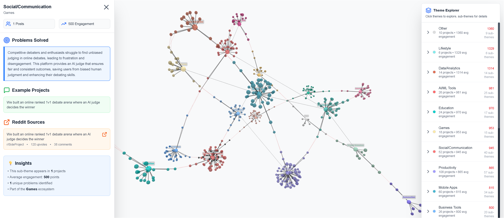

# Reddit Trend Analysis Force Graph

An interactive 3D force graph that analyzes r/SideProject to visualize what the community is building, the problems they're solving, and emerging trends in the side project ecosystem.


**Data Freshness:** This analysis reflects r/SideProject activity from June 21 - July 21, 2025 (scraped July 21, 2025)

## What This Does

- **Scrapes** r/SideProject posts and comments
- **Classifies** projects using AI to identify themes and problems solved
- **Visualizes** the ecosystem as an interactive 3D force graph
- **Explores** trends with clickable nodes that show detailed problem analysis
- **Links back** to original Reddit discussions

## Architecture

```
Raw Reddit Data → AI Classification → Graph Structure → Interactive Visualization
```

1. **Reddit Scraper** → `raw_reddit_data.json`
2. **LLM Classifier** → `trend_analysis_results.json`
3. **Graph Converter** → `hierarchical_graph_data.js`
4. **Next.js App** → Interactive 3D Force Graph

## Project Structure

```
reddit-trend-analysis/
├── reddit/                          # Python Data Pipeline
│   ├── reddit_scraper.py           # Scrapes r/SideProject
│   ├── llm_classifier.py           # AI classification of posts
│   ├── hierarchical_graph_converter.py  # Creates graph structure
│   ├── config.py                   # Configuration & API management
│   ├── results/                    # Output data files
│   │   ├── raw_reddit_data.json
│   │   ├── trend_analysis_results.json
│   │   └── hierarchical_graph_data.js
│   └── test/                       # Test files
├── app/                            # Next.js Frontend
│   ├── components/
│   │   ├── ForceGraph3D.js         # 3D graph visualization
│   │   ├── ProblemsPanel.js        # Detailed problem analysis
│   │   └── ThemeNavigator.js       # Theme exploration sidebar
│   ├── data/                       # Graph data (copy from reddit/results/)
│   └── page.js                     # Main application
├── .env                            # Environment variables
├── .gitignore
└── README.md
```

## 🚀 Quick Start

### Prerequisites

- Python 3.8+
- Node.js 18+
- Reddit Developer Account
- OpenAI API Key

### 1. Clone & Install

```bash
git clone https://github.com/sacka777/reddit-ecosystem-analyzer
cd reddit-trend-analysis

# Install Python dependencies
python -m venv venv
source venv/bin/activate  # On Windows: venv\Scripts\activate
pip install -r requirements.txt

# Install Node.js dependencies
npm install
```

### 2. Environment Setup

Create `.env` file in the reddit directory:

```env
REDDIT_CLIENT_ID=your_reddit_client_id
REDDIT_CLIENT_SECRET=your_reddit_client_secret
REDDIT_USER_AGENT=your_app_name
OPENAI_API_KEY=your_openai_api_key
```

### 3. Run the Data Pipeline

```bash
# Activate virtual environment
source venv/bin/activate

# Step 1: Scrape Reddit data
cd reddit
python reddit_scraper.py

# Step 2: Classify with AI
python llm_classifier.py

# Step 3: Generate graph structure
python hierarchical_graph_converter.py

# Step 4: Copy graph data to Next.js
cp results/hierarchical_graph_data.js ../app/data/
```

### 4. Run the Frontend

```bash
# From root directory
npm run dev
```

Visit `http://localhost:3000` to explore the interactive graph!

## Configuration

Edit `reddit/config.py` to customize:

```python
class Config:
    # Scraping parameters
    SUBREDDIT = 'SideProject'        # Subreddit to analyze
    TIME_FILTER = 'month'            # 'day', 'week', 'month', 'year'
    POST_LIMIT = 100                 # Number of posts to scrape
    COMMENT_LIMIT = 5                # Comments per post
    
    # File paths
    OUTPUT_DIR = 'results'
    RAW_DATA_FILE = 'raw_reddit_data.json'
```

## How to Use

### Interactive Graph

- **Hover** over main theme nodes to see sub-themes
- **Click** sub-theme nodes to open detailed analysis
- **Drag** to explore connections
- **Zoom** and rotate for different perspectives

### Theme Navigator

- **Browse** all themes in the right sidebar
- **Expand** themes to see sub-categories
- **Click** any sub-theme for instant analysis

### Problems Panel

- **View** specific problems each theme solves
- **See** example projects and Reddit discussions
- **Click** Reddit links to view original posts
- **Analyze** engagement metrics and insights

## 🔧 Development

### Adding New Analysis

1. Modify the classification prompt in `llm_classifier.py`
2. Update theme colors in `hierarchical_graph_converter.py`
3. Customize visualization in `ForceGraph3D.js`

### Extending Functionality

- Add new data sources beyond Reddit
- Implement different graph layouts
- Add filtering and search capabilities
- Export analysis reports

## Sample Output

The analysis reveals trends like:

- **Productivity Tools** dominating the ecosystem
- **AI/ML Tools** with high engagement rates
- **Browser Extensions** solving specific workflow problems
- **Entertainment** projects with viral potential

## Contributing

1. Fork the repository
2. Create a feature branch (`git checkout -b feature/amazing-feature`)
3. Commit changes (`git commit -m 'Add amazing feature'`)
4. Push to branch (`git push origin feature/amazing-feature`)
5. Open a Pull Request

## 📝 License

This project is licensed under the MIT License

## Acknowledgments

- r/SideProject community for the amazing projects
- React Force Graph for 3D visualization

## Issues & Support

Found a bug or have a suggestion? [Open an issue](https://github.com/savka777/reddit-ecosystem-analyzer/issues)

---
